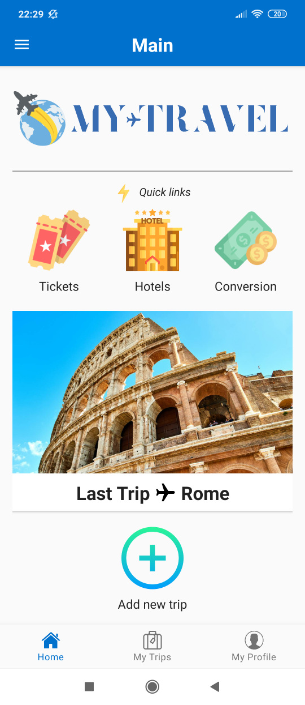
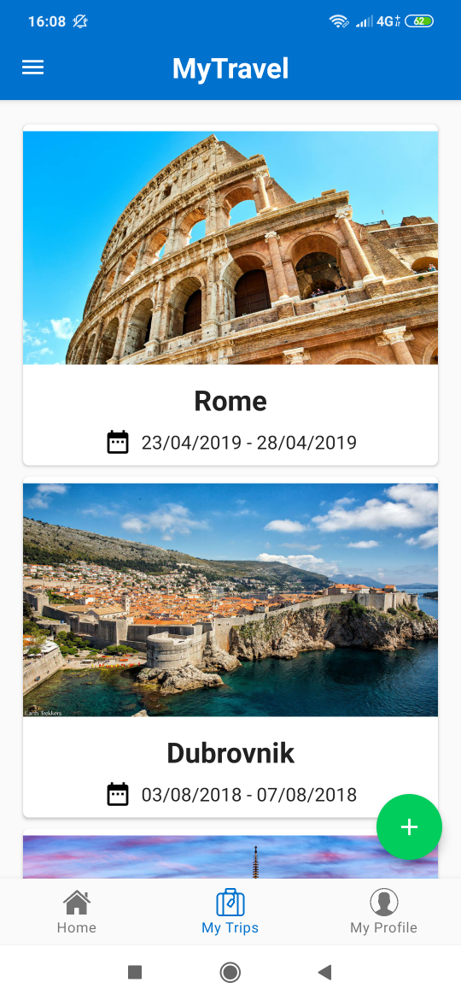
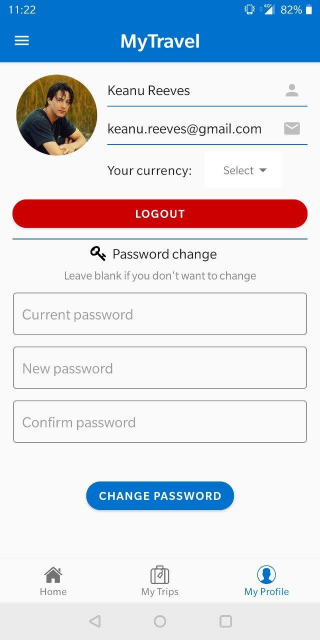
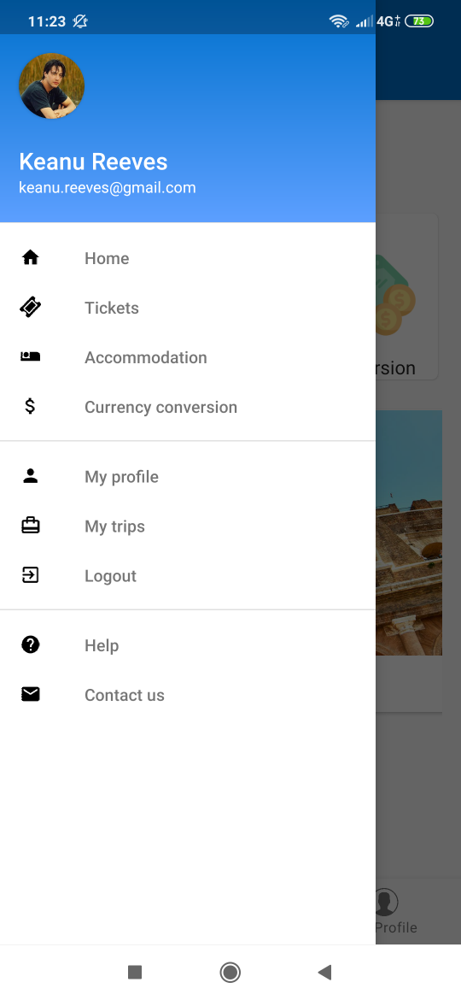
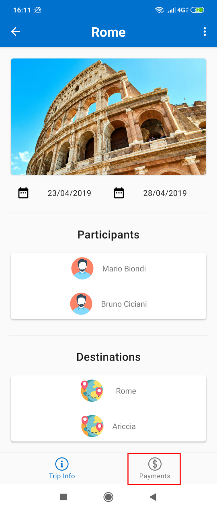
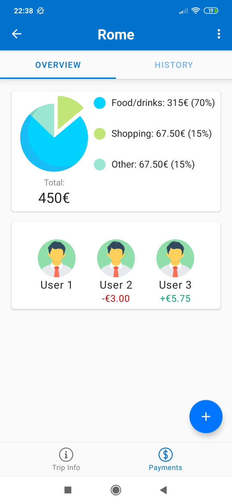
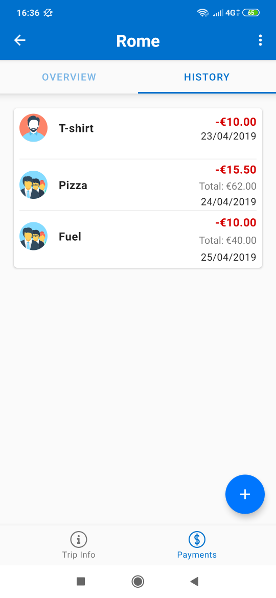
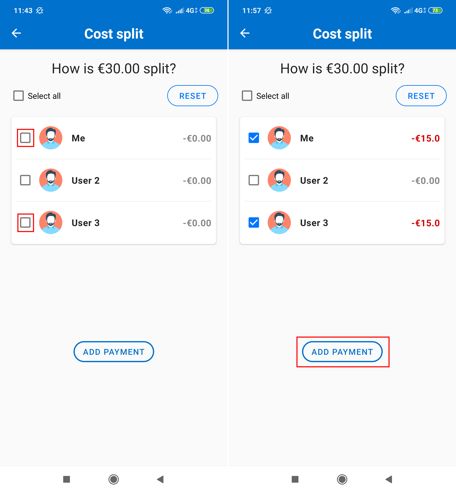
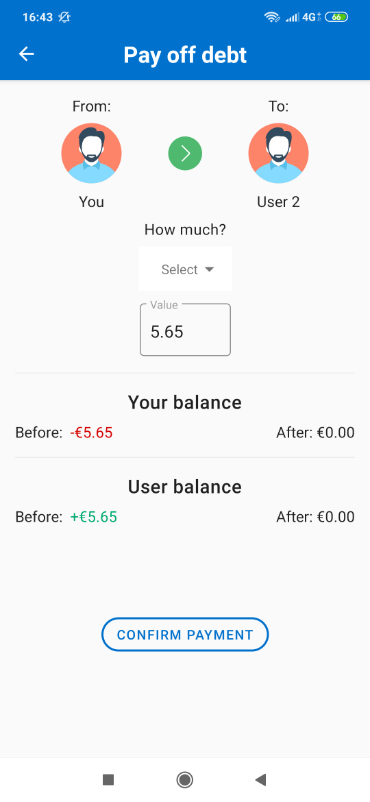

# Overview
The main idea of **myTravel**  is to provide to travelers an intuitive and easy-to-use application to let  them  to keep track of all the payments done  during a trip, in order to always be up to date with their  budget. In particular, it can be used  alone or in group, and in this  latter  case myTravel  offers the possibility  to split some payments among the participants so that  anyone can get  rid of keeping bills with each  other.

*myTravel* will be useful for:
 -   **Alone Holiday Traveler**, which accounts all his/her spendings into the app in order to have an idea of his/her balance
    
 -   **Group Holiday Travelers**, which want to split some payments among the participants
    
 -   **Business Travelers**, which want to distinguish between personal spendings and business ones which have to be refund by the company

# Get started
The main page of the application is composed by 3 tabs, which can be navigated by means of the **lower Navigation Bar**:

- **Home**: where you find the most important shortcuts for searching tickets and accomodations, for the currency conversion tool and finally for the last trip you have added;

- **My trips**: where you find all the trips you have added to the application so far;

- **Profile**: where you can find your information such as your **username**, your **email**, your **profile picture** etc...

Moreover, an hidden side menu is always present, which other than the shortcut just mentioned, it also contains a quick **logout** button, an **help** button which brings you to this documentation and a **contact us** button which allows you to directly contact the developers via email.

# Your profile
The profile page of the app, which is reacheable by the right-most tab of the main page, shows the informations about you that are relevant for the app.
You will find the email and the username that identify you (which cannot be changed), your profile picture, your preferred currency and a form where you can change your current password (if you registered via email).

- In order to change the currency, it is sufficient to tap on the Dropdown menu and choose the currency.

- In order to change the profile picture, it is sufficient to tap on the profile picture and the choose a new one from the gallery.

**Note:** the password exists (and thus can be changed) only if the user signed up via email. In order to change the password, you firstly have to type the current (old) one in the proper field, and then the new one. Finally you have to re-type the new one and press the *change button* button.

# Add a trip

**Note**: *all the informations you will insert about a trip can be changed at any time.*

Adding a trip is quite simple. Either you click on the *Add a trip* button in the homepage or you click the *floating button* in *My trips* page. You will be presented with the following page:

Then, with the *Choose picture* button you can choose a picture for the trip, then you can insert the name of the trip in the *Trip name* text field, and departure and return dates by simple clicking to the calendar button and choosing the date from the google calendar that blows up. Then you can start choosing the participants of the trip, by just searching them in the *Add participants* section, typing their **Usernames**. Finally, you can optionally add the destinations your trip will be composed of and a simple text note useful for remember something. Once you have done, tap on *CREATE TRIP* button.

# Edit a trip

As already said in the **Add a Trip** section, you can always edit trip informations. Go to *My trips* tab of the homepage, and then tap on the trip you want to modify. You will get a page like the following:

Tap on the *3 dots* on the top-right corner and select *Edit*.

Now you are on a page very similar to the one when you add a trip:

Once you get to the Edit trip page, you can edit each field in the same way you compiled it when you added the trip.

Once you have done, tap the *check* on the top-right and you are done:

# Delete a trip

In order to delete a trip, go to *My trips* tab of the homepage and tap to the target trip.

Once you are in the *Trip Page*, tap on the *3 dots* on the top-right and then tap **Delete**.

A pop-up will appear, asking you a confirmation for deleting the trip, tap on the **red delete button** and you are done:

# Trip payments overview

When on a *Trip Page*, you can see there are two tabs in the bottom navigation bar,  and they are **Trip info** and **Payments**. If you tap on **Payments**:

you will reach the payments tab:

The **Payments** tab is composed by two sections: **Overview** and **History**.

You are now in the Overview section, where you can find a diagram showing how much you spent for that trip so far. Then you find the list of participants of the trip, and for each of them, if you owe to him a certain amout, a corresponding **red amount** is displayed below him, while if he owe to you a certain amount, a corresponding **green amount** is displayed below him.

# Trip payments history

Once you tap the **Payments** tab of the bottom navigation bar of a trip page, you will get to the *payments overview* section. On the top there is a navigation bar allowing you to change section and so to view the **History** section:

You will get to a page listing all the payments you have done for that trip:

Each payment in the list is displayed in terms of an icon, a name and an amout. If the icon represents a **single guy** it means that that payment was a personal payment (the other participants will never be able to see it in their app), if the icon represents a **group** it means that that payment is associated to a group payment and the amount is only your contribution.

# Add a payment

In order to add a payment, go to the **Payments** tab of a Trip Page and go to the **Overview** section. You will see a floating button on the bottom-left of the page. Tap on it and select *Add new payment*:

Then, insert the *description* (e.g. domò sushi), the *amout*, the *currency*, and the *date*, then tap the *continue* button:

Finally, you will get to a page where it is displayed the list of participants of the trip the current payments belongs to. If the payment you are adding is a personal payment, just select yourself (selected by default), otherwise if it is a group payment tap the *checkbox* near each user that will be a participant of that payment, the amount splitting will be done automatically and shown near each user you select. In order to select all the participants in a single tap, check the *Select all* checkbox, in order to cancel all the selections, tap the *Reset* button.

Once you have chosen all the participants, tap the *done* button:

# Pay off a debt

If you want to get rid of a debt, go to the **Payments** tab of a Trip Page and go to the **Overview** section. You will see a floating button on the bottom-left of the page. Tap on it and select *Pay off debt*:

You get into the following page:

on the right of the arrow, you can select the participant that will receive the amount of money, while below the arrow you can select the amount. Below the amount, it will be displayed the remaining debt you still owe to that participant if any, in particular:

- If you pay an amount higher than the debt, then the other participant will owe to you the remainder

- If you pay the exact amount of the debt, the debt will be fixed

- If you pay an amount lower than the debt, then you will still owe to that participant the remainder

Once you have chosen the amount, tap on **Pay** to let the app to do the computation and to update the payments overview of the trip.

# Payment page

You can always return to a payment that has been done for a trip in order to view its details. Go to the **History** section of the **Payments** tab of a trip page. 

A list of all the payments of the trip will appear, tap to the target one.

You will get to a page where a payment recap is show, in terms of description, total amout, date of payment and a list of participants for that payment, togheter with the amount payed by each one:

# Edit/Delete a payment

You can always return to a payment that has been done for a trip in order to edit its details (e.g. the amount, the participants and so on). In order to edit it, just go to the payment page, you will see a *pencil icon* on the top right, tap on it:

Now it will be displayed a page identical to the one when you add a payment, so as you inserted the fields of that payment in the same way you can edit them. A for the *Add payment* steps, you have to tap on the **continue** button and finally, in the last page, on the **done** button.

If you instead want to **delete** a payment, it is sufficient, in the *Edit payment* page, to tap on the *trash icon* on the top right, and tap on the **red delete button** in the dialog that pops up:

